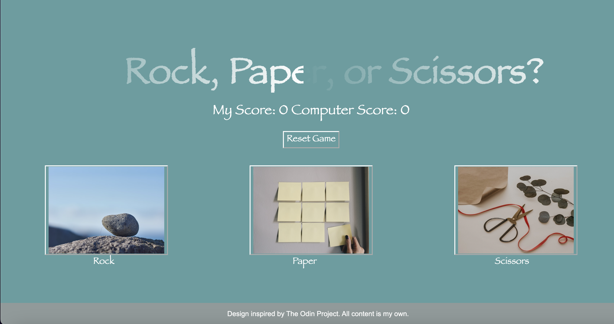
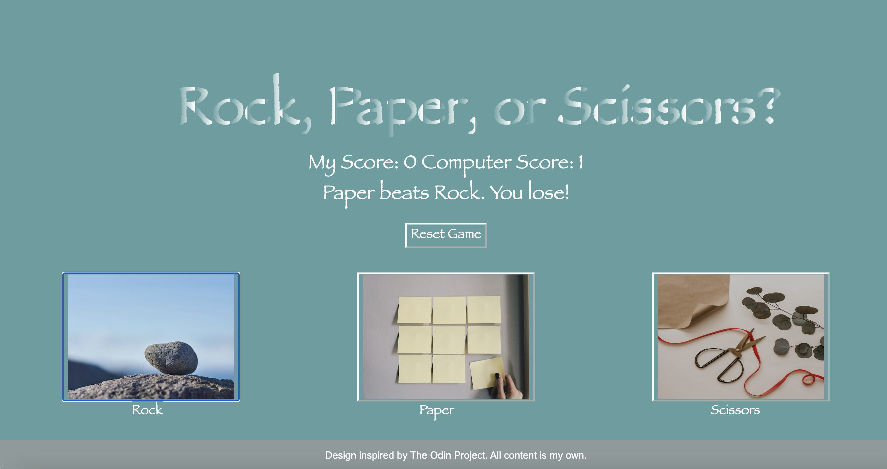
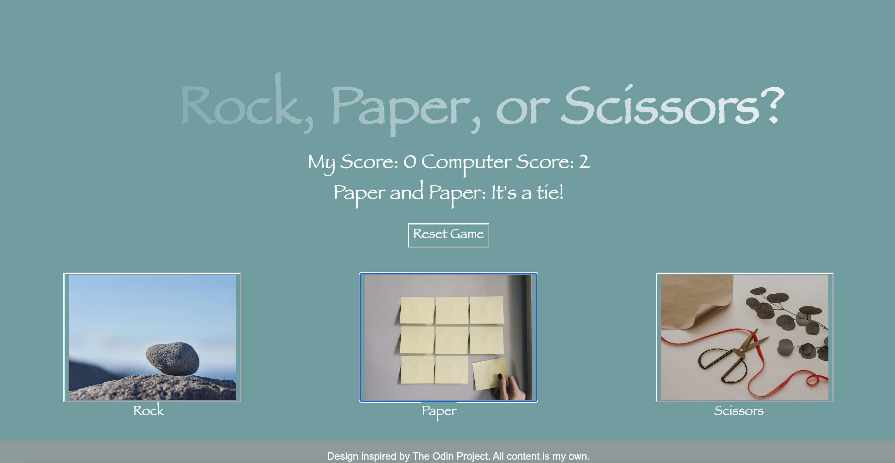
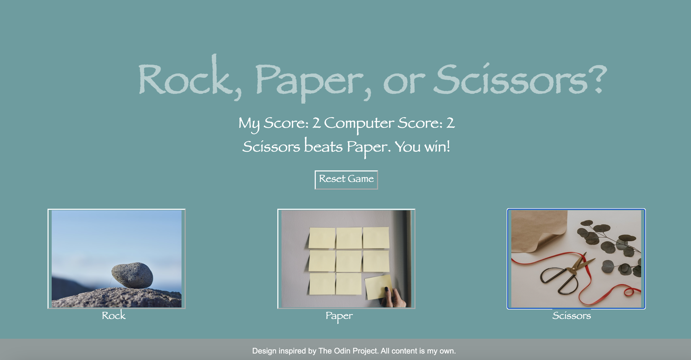

# rock-paper-scissors
## Project 3: Rock, Paper, Scissors built with JavaScript, HTML, and CSS (The Odin Project)

## Description: 
Welcome to my third web development project! This is part of my coursework in The Odin Project, a free, open-source curriculum to learn fullstack web development! 

This project was built in JavaScript, HTML, and CSS. This project is designed for the web only, and has not been modified for mobile version.

The task for this project was to build a Rock, Paper, Scissors game with an interactive UI. I hope you enjoy! 

## Images: 
All images are free, public images from Unsplash.com 

## Screenshots:

